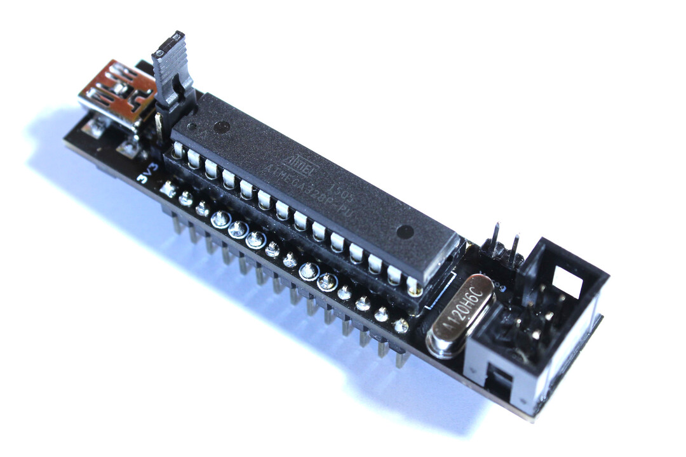

# RUDY - the Random USB Device

RUDY started out as a test and play-around device for USB development using the [Objective Development V-USB library](https://www.obdev.at/products/vusb/index.html), but also serves as standard ATmega328 development board.

## Links
- [Official Website](https://rudy.craplab.fi/)
- [Hackaday.io Project Page](https://hackaday.io/project/174101-rudy)

## Features

- breadboard-friendly prototyping board, taking up only one additional row on each side compared to a standalone ATmega328 microcontroller
- Arduino compatible [..ish](firmware/arduino/)
- USB port wired to the ATmega328 for out-of-the-box USB functionality via the V-USB library
- own, dedicated [USB VID/PID pair](http://pid.codes/1209/B00B/) thanks to [pid.codes](http://pid.codes/)
- USB-powered with additional 3.3V voltage regulator on board to select either 5.0 or 3.3V supply voltage
- clocked by 12.0 MHz crystal to comply with V-USB and also 3.3V supply voltage
- 6-pin ISP header for programming, with additional option to power the board directly from the programmer
- power-indicating LEDs mounted under the IC, shining in a mysterious glow (oh yeah)
- DIP28 ATmega328, allowing easy replacement if it ever gets fried (no no)
- and of course: fully open source

## Hardware

RUDY is primarily a hardware project, so all the design file for KiCad along with the schematic as PDF and Gerber files are found in the [`hardware/`](hardware/rudy/) directory. And if you want to go straight ahead and build your own board, [the PCB is available from OSH Park](https://oshpark.com/projects/RQf8bXd4).

As RUDY can theoretically function as an [USBasp programmer](https://www.fischl.de/usbasp/), there's also [an adapter board](hardware/usbasp-adapter) available - and is also [available from OSH Park](https://oshpark.com/projects/pueZ0qkO)

## Firmware

Again, RUDY is primarily a development board, and as such is there for _your_ firmware. But well, everything and everyone has to start somewhere, so the [`firmware/`](firmware/) directory has a (still-to-grow) collection of example projects, both using the V-USB library and using RUDY as regular, ATmega328 microcontroller board.

## License
RUDY is fully open source. All hardware files are released under the [CERN Open Hardware License v1.2](https://ohwr.org/project/licenses/wikis/cern-ohl-v1.2), and all example source code is released under the [MIT License](https://choosealicense.com/licenses/mit/).

