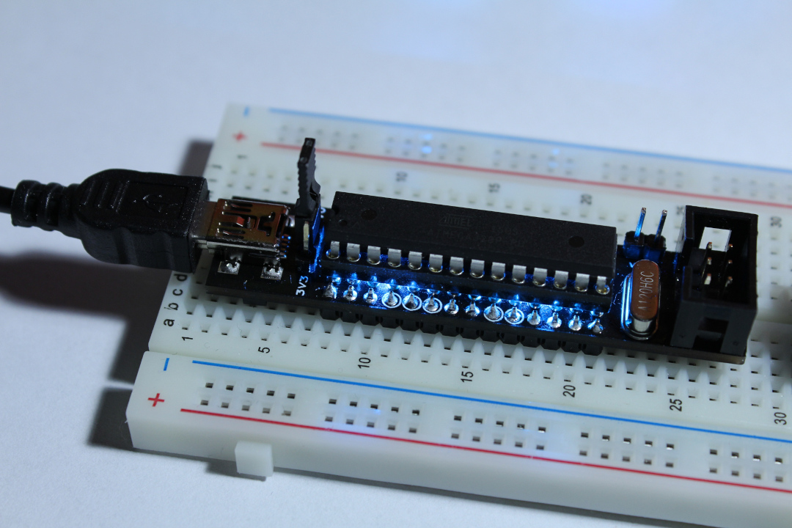

# RUDY - Firmware Examples

This is a collection of firmware examples to play around and explore RUDY with.

As RUDY is a simple ATmega328 development board, there's nothing too magical in this code collection here and will also work with any other ATmega328 board - which is kinda the point of RUDY as a rapid prototyping board. However, the examples are laid out specifically for RUDY and its pin configuration, so you might have to adjust a few bits if you're planning to use them on different hardware.

RUDY, being _the Random USB Device_, was initially built for use the [V-USB library](https://www.obdev.at/products/vusb/index.html), but using the library itself is of course fully optional. As V-USB adds certain complexity to the build system and code itself, The examples are split up in different folders, so focus can be put on either using RUDY as a regular ATmega328 device, and using it specifically as a USB device.

- [`v-usb/`](v-usb/) contains example to use RUDY as USB device, with main focus on the USB part itself
- [`bare-metal/`](bare-metal/) contains examples to use RUDY as a regular ATmega328 device
- [`arduino/`](arduino/) contains examples to use RUDY within the Arduino ecosystem

More information on the specifics of all that can be found inside those directories.

Note that Arduino support is more a lucky side effect of using the ATmega328 here, and not what RUDY is really aiming at. But since it's possible, I figured: why not. However, the main instructions here are for using RUDY as bare metal / bare metal + V-USB device, so if you're planning on using it in the Arduino ecosystem, you can probably skip most of the instructions here.


## Requirements

While the focus of the examples differs, and their build environment is set up slightly different, the underlying tools to actually compile the source code and flash the resulting firmware onto the device are the same. Both use [GCC](https://gcc.gnu.org/wiki/avr-gcc) and [AVRDUDE](https://www.nongnu.org/avrdude/) wrapped into a `Makefile` to accomplish this, so you will need those tools and their dependencies installed on your computer in order to get started.

### Installing via provided script

To make sure you have everything you need installed, the [`check-system.sh`](check-system.sh) script is provided. It will check if all required executables are present on the system, and if so, compile a little dummy AVR C file and see if that succeeds. If all goes well, it means you're ready to get going with the examples, otherwise it will tell you what packages you're most likely missing.

If you're using a Debian based distribution (like Debian itself, Ubuntu or its variants, Linux Mint, or Raspbian) or a Red Hat based distribution (like Red Hat, Fedora, or CentOS), the script will even offer to install the missing packages right away. It will ask first though, so nothing is going to just happen automatically.

### Installing manually

To install all required packages depends on the Linux distribution you are using.

#### Debian / Ubuntu / Linux Mint / Raspbian / ...
```
sudo apt install make gcc-avr avr-libc avr-binutils avrdude
```
If `apt` doesn't exist, try `apt-get`.

#### Red Hat / Fedora / CentOS
```
sudo dnf install make avr-gcc avr-libc avr-binutils avrdude
```

The main difference between Debian and Red Hat based systems is `gcc-avr` vs `avr-gcc` as package name for GCC.

#### Other Linux distributions / operating systems

Other Linux distributions will most likely have packages with equal or somewhat similar names as the ones above. Arch for example has the same name as Red Hat.

In case of macOS, it seems to be possible to install the same toolchain via `brew`, although package names might slightly differ.

As for Windows, I'm afraid you're on your own, and I'm not sure will this even work at all under Windows as I don't have the means to test and verify this myself. WSL might help, Cygwin might be an alternative. Sorry.

(Comments and contributions on improving and extending this are very welcome!)


## Building the Examples

Unless stated otherwise, the build environment will do all the heavy lifting, and each example can be compiled by a simple call to `make` from within their dedicated directory.

For example, to compile the [V-USB Hello USB example](v-usb/01_hello-usb/), enter its directory and simply run `make`:
```
[firmware/]$ cd v-usb/01_hello_usb/
[firmware/v-usb/01_hello_usb/]$ make
avr-gcc ...
...
avr-objcopy -O ihex -R .eeprom rudy_hello-usb.elf rudy_hello-usb.hex
   text	   data	    bss	    dec	    hex	filename
   1470	      2	     43	   1515	    5eb	rudy_hello-usb.elf
[firmware/v-usb/01_hello_usb/]$
```

That's it.


## Powering RUDY

As RUDY can be powered from both USB and the programmer itself, make sure the power arrangements are set up properly. The power itself is set via a jumper, and to avoid any misconfigurations, it's best to only ever keep one single jumper around.

**Note:** the pictures below show two different devices with different LED setup each - the LEDs do not change colors depending on the supply voltage option!

### Powering RUDY via USB port



If RUDY is powered via USB, the jumper will be either on the 3.3V or 5.0V selector. RUDY can remain powered that way during flashing, so simply connect the ISP cable and leave the USB connected as well.

### Powering RUDY via the programmer


Alternatively, move the jumper from the USB power selector to the pins next to the ISP port itself, where it says "Vprog". In this case, the programmer will provide the power directly to RUDY. Note that you can still use USB functionality in this setup, you just need to keep the programmer powered up so RUDY gets the power as well.


## Flashing the Firmware

As with compiling the firmware, flashing it to RUDY is also handled by the build system.

To flash the compiled firmware, connect the programmer to RUDY's 6-pin ISP port and run
```
make program
```
from within the example's directory (same place you ran `make` to compile it).

### Setting up the programmer
The build system itself is by default set up to use the [USBasp programmer](https://www.fischl.de/usbasp/), as it is a cheap, open source programmer that does the job very well. Plus, [RUDY can be programmed to act as USBasp itself](v-usb/06_usbasp/).

If you're using a different programmer, adjust the command line settings in the [`programmer.mk`](programmer.mk) file within this directory.

The default content will look like this:
```
AVRDUDE_PROGRAMMER = -c usbasp
```
and will be passed as-is as command line parameter to AVRDUDE itself.

For example, to use [Adafruit's USBtinyISP](https://learn.adafruit.com/usbtinyisp), adjust the file to:
```
AVRDUDE_PROGRAMMER = -c usbtiny
```

If you use a programmer that requires additional command line parameters, for example the port or baudrate, just add it along with the programmer itself in the `programmer.mk` file:
```
AVRDUDE_PROGRAMMER = -c avrispmkII -P usb
```

## Running the Examples

Each example acts of course differently, so please refer to each example's own documentation to see what to expect and how to use it.

## Miscellaneous

### Other Makefile targets

In addition to compiling and flashing, `make` supports a few additional targets:

- `clean` removes all intermediate compiled object files (`.o` files), which can be useful to make sure the code is built from scratch (oftentimes needed if for example a header file was changed).
- `distclean` runs `clean` and in addition also removes the fully compiled executables, HEX files and map file. This essentially returns the example directory to its clean, initial content state.
- `burn-fuse` sets the ATmega328's fuses the way RUDY needs them, which mainly concerns the clock setup. If you need to replace the microcontroller, or want to change the fuses for your own purposes, this will initialize / reset them.

### Troubleshooting

**Note:** to leave every option open to the user, RUDY doesn't come equipped with any reset circuitry. The programmer will toggle the reset line during programming, and in some cases it may happen that the line won't be released, leaving RUDY in reset state. If flashing firmware succeeded but nothing seems to happen, remove the programmer from the ISP port and re-connect RUDY via USB (make sure the voltage selection jumper is set to either 3.3V or 5.0V then).

