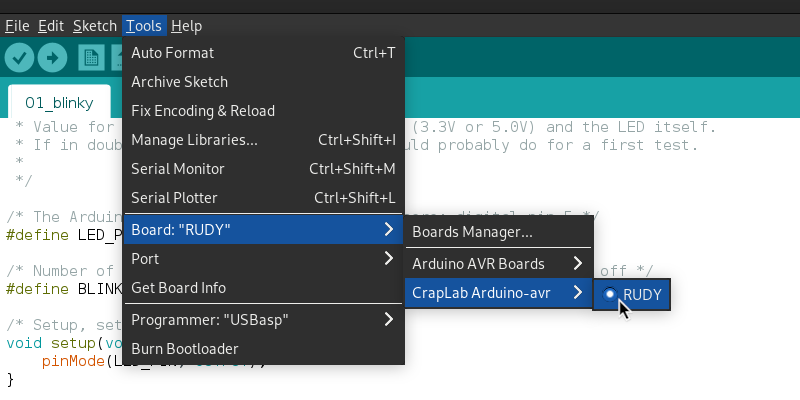
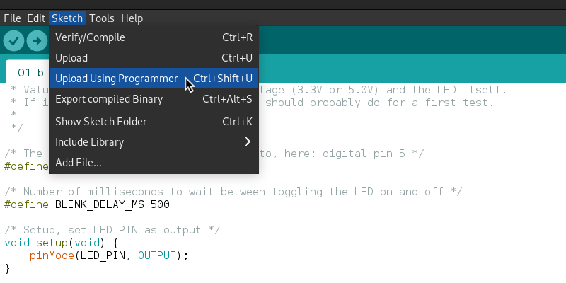

# RUDY - Arduino Example 01: Blinky

Implements the classic hardware-equivalent of a Hello World: Blinking an LED.

## Setting it up

By default, the code expects the LED to be connected to Arduino's Digital Pin 5, located at pin 11. It is always recommended to use a [current limiting resistor](https://www.sparkfun.com/tutorials/219) in series with the LED to lower the risk of accidentally destroying it. The value of that resistor depends on the LED itself, but a good starting value would be for example 120 &Omega;.

## Running it

Open the example `.ino` file in the Arduino IDE and make sure RUDY is selected as active board ([see here](https://github.com/sgreg/craplab-arduino) to add board support for RUDY)

Alternatively, you can select the Arduino Uno as board, but be aware that RUDY has a lower clock speed (12MHz vs 16Mhz), so the actual blink delay won't match what you declare it as.

Next, connect your external programmer to RUDY and set it up in the Arduino IDE. There are many programmers available, so best thing is to just check online how to do that with your specific one. Once that's set up, upload the sketch - but remember to use the "Upload Using Programmer" option here!

Tadaa - the LED connected to Digital Pin 5 (ATmega328 pin 11) should now blink.

