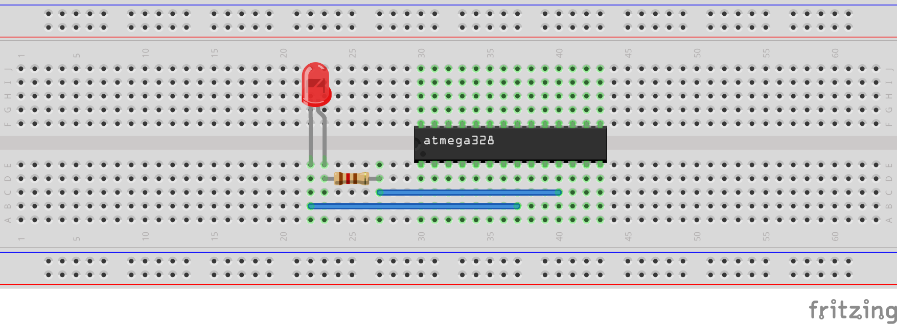

# RUDY - Bare Metal Example 01: Blinky

Implements the classic hardware-equivalent of a Hello World: Blinking an LED.

## Setting it up

By default, the code expects the LED to be connected to PD5, located at pin 11. It is always recommended to use a [current limiting resistor](https://www.sparkfun.com/tutorials/219) in series with the LED to lower the rist of accidentally destroying it. The value of that resistor depends on the LED itself, but a good starting value would be for example 120 &Omega;.

