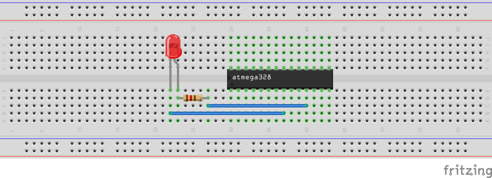

# RUDY - V-USB Example 02: USB LED

Control an LED via USB to turn it on, off, or to a given PWM duty cycle value.

This example is split into a [`device/`](device/) directory that has the firmware for RUDY, and a [`host/`](host/) directory that has the host-side control software in form of a Python script.

## Set it up

The device is set up the same way as the [bare metal Blinky example](../../bare-metal/01_blinky/), with the LED expected at GPIO port PD5 / pin 11 of the microcontroller. It's a good idea to add a [current-limiting resistor](https://www.sparkfun.com/tutorials/219) in series with the LED to lower the risk of accidentally destroying it. The value of that resistor depends on the LED itself, but a good starting value would be for example 120 &Omega;.



## Build and flash it

The general instruction in the [parent directory's README](../). apply here, but the firmware itself is found in the [`device/`](device/) directory, so the `make` commands need to be run from within that directory instead of the example's main directory.


## Use it

If everything went well and the hardware is set up correctly, once the device is plugged in, the LED should turn on in a semi-bright manner and the following information should be visible in the syslog or `dmesg`:

```
[106972.432085] usb 2-3.3: new low-speed USB device number 36 using xhci_hcd
[106972.529252] usb 2-3.3: New USB device found, idVendor=1209, idProduct=b00b, bcdDevice= 1.00
[106972.529256] usb 2-3.3: New USB device strings: Mfr=1, Product=2, SerialNumber=3
[106972.529259] usb 2-3.3: Product: RUDY
[106972.529261] usb 2-3.3: Manufacturer: CrapLab
[106972.529263] usb 2-3.3: SerialNumber: LED Example
```

If the LED doesn't light up, double-check that you are using the expected pin (by default port PD5 on pin 11).

### Python control script

The Python control script requires Python3 and the [PyUSB module](https://github.com/pyusb/pyusb) installed. PyUSB can be usually installed via your Linux distribution's package manager, or via `pip install pyusb`.

If you have both available, you should be able to run the [`ledcontrol.py`](host/ledcontrol.py) script located in the [`host`](host/) directory.

```
[02_usb-led/]$ cd host/
[02_usb-led/host/]$ ./ledcontrol.py 
Welcome to LED Example

Available commands:
on              turn LED on
off             turn LED off
pwm             read the current PWM value
pwm <value>     set LED to given PWM value
                value can be either decimal [0..255] or hexadecimal [0x00..0xff]
q | quit        quit


> 
```

Follow the instructions of the available commands, and you should be able to turn the led fully `on`, `off`, or anything in between with the given `pwm` value.

If the script says "`Error: No device found`", make sure you have flashed RUDY with the correct example firmware, the device is [powered correctly](../../#powering-rudy), and it shows up in the syslog or `lsusb` output.


