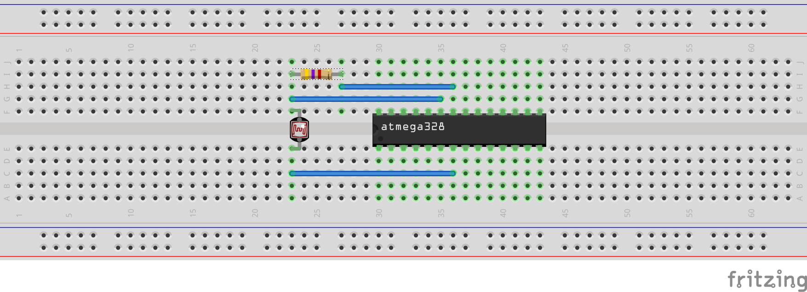

# RUDY - V-USB Example 04: USB MIDI Device

Turn RUDY into a USB MIDI device, using analog-to-digital conversion as playback source.

Periodically reads sensor values from the ATmega's ADC and converts the read values into MIDI notes. The MIDI part itself is taken directly from [4chord MIDI](https://github.com/sgreg/4chord-midi) and its own [USB setup](https://github.com/sgreg/4chord-midi/blob/master/firmware/usb.c), as it has proven well functioning. The ADC handling is rather basic but good enough for this purpose - for more serious analog-to-digital conversion applications, it's recommended to take a look at the [_ADC of megaAVR in Single-Ended Mode_ Application Note](http://ww1.microchip.com/downloads/en/AppNotes/AN2538-ADC-of-megaAVR-in-SingleEnded-Mode-00002538A.pdf) (AN2538 / AVR126).

## Some details

There are 127 MIDI notes available, but the lower and higher range of those notes is not all that useful in a random "music instrument" like this, so we'll limit the range of actually used notes to 28 (E1) and 91 (G6). As the Atmega328 uses a 10-bit ADC, we simply take only the top 6 bit, which gives us 64 values that aren't too sensitive to small changes in the sensor readings, and add an offset of 28 to them.

For example:
```
                  from 0x2c0 == 704
                    to 0x2cf == 719
                /                   \
Raw ADC value:  1 0  1 1 0 0  x x x x
                \          /
Top 6 bits:      0x2c == 44
Offset:                + 28
                       -----
MIDI note:               72 == C4
```

Any ADC value between 704 and 719 (inclusive) is going to end up as a C4 note. Due to this range, tiny variations in the reading won't have any too big impact on the playback, therefore a simple ADC hardware setup will do here.

## Set it up

The device is set up to expect a sensor connected to analog channel 0, i.e. `ADC0` / `PC0` on pin 23. An example sensor could be a simple light-dependent resistor (LDR), also known as a [photoresistor](https://en.wikipedia.org/wiki/Photoresistor) or simply a light sensor, but practically any [voltage divider](https://en.wikipedia.org/wiki/Voltage_divider) with a variable resistor will work - for example a [thermistor](https://en.wikipedia.org/wiki/Thermistor) as temperature sensor, or even just a regular potentiometer.

Alternatively, a sensor that directly outputs its voltage could be directly connected to the ADC pin without the need of a voltage divider. Sensors like ADXL335 accelerometer or an LM35 temperature sensor.

But here's what a set up with a variable resistor and voltage divider could look like:



In this case, the brighter the light is shining to the photoresistor, the lower its resistance and therefore the higher the voltage the ADC will read. Higher voltage results in a higher value read from it, so in other words: the brighter the light, the higher the note it will send - and vice versa.

## Use it

When plugging in, the following information should be visible in the syslog or `dmesg`:

```
[ 6052.830880] usb 2-3.4: new low-speed USB device number 23 using xhci_hcd
[ 6053.373418] usb 2-3.4: New USB device found, idVendor=1209, idProduct=b00b, bcdDevice= 1.00
[ 6053.373422] usb 2-3.4: New USB device strings: Mfr=1, Product=2, SerialNumber=0
[ 6053.373424] usb 2-3.4: Product: RUDY
[ 6053.373426] usb 2-3.4: Manufacturer: CrapLab
[ 6059.558949] usb 2-3.4: USB disconnect, device number 23
```

Note that even though [`usbconfig-rudy.h`](usbconfig-rudy.h) sets a serial number, it won't be in use here. `lsusb` won't show it either, it will however show that is indeed an `Audio` class with `MIDI Streaming` as subclass:

```
$ lsusb |grep CrapLab
Bus 002 Device 023: ID 1209:b00b Generic CrapLab Random Device

$ lsusb -vs 002:023

Bus 002 Device 023: ID 1209:b00b Generic CrapLab Random Device
Device Descriptor:
...
  idVendor           0x1209 Generic
  idProduct          0xb00b CrapLab Random Device
  bcdDevice            1.00
  iManufacturer           1 CrapLab
  iProduct                2 RUDY
  iSerial                 0
...
    Interface Descriptor:
...
      bInterfaceClass         1 Audio
      bInterfaceSubClass      3 MIDI Streaming
...
```

### Use it as MIDI device

To verify that it's recognized as an actual MIDI device, we can for example use `aconnect` (which is part of [alsa-utils](https://github.com/alsa-project/alsa-utils) that should be available in your Linux distro's package manger), where it should show up as input device:
```
$ aconnect -i
...
client 24: 'RUDY' [type=kernel,card=2]
    0 'RUDY MIDI 1     '
```

We can connect the device for example to FluidSynth (I wrote some detailed instructions on that for [the 4chord MIDI project](https://github.com/sgreg/4chord-midi#simple-playback-with-fluidsynth)), or use `aseqdump`, which is also part of the alsa-utils package. To catch the events of the right device, we need to provide the device's port, which `aconnect` earlier showed - in this case, it's `client 24` and its id `0`, therefore `24:0`.
```
$ aseqdump -p 24:0
Waiting for data. Press Ctrl+C to end.
Source  Event                  Ch  Data
 24:0   Note on                 0, note 44, velocity 127
 24:0   Note off                0, note 44, velocity 127
 24:0   Note on                 0, note 43, velocity 127
 24:0   Note off                0, note 43, velocity 127
 24:0   Note on                 0, note 48, velocity 127
...
```
Your output may vary, as it reads the ADC value and your setup may be different, but the main principle should be the same.

Congrats, you can now connect it to a software synthesizer and play music with RUDY!

