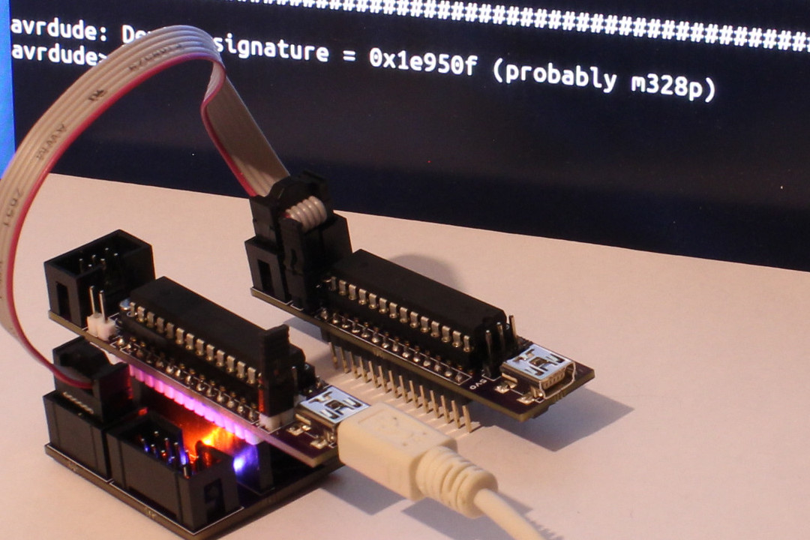

# RUDY - V-USB Example 06: USBasp AVR Programmer

[Thomas Fischl](https://www.fischl.de/)'s awesome [USBasp AVR programmer](https://www.fischl.de/usbasp/) adjusted for RUDY. If combined with the [USBasp adapter board](../../../hardware/usbasp-adapter/) (or a breadboard arrangement of that), RUDY can serve as actual USBasp programmer for any supported AVR device, including other RUDYs.

### Changes to original USBasp firmware

Since USBasp itself is built around V-USB, the required adjustments were rather minimal, and mostly concerned the build system and matching up the usbconfig.h file. There was however a small issue that required actual code adjustments in [`main.c`](main.c), as the original USBasp's hardware differs from RUDY. To make the changes clearer and easier reproducible, [a patch](rudy.patch) is included here.

The code here is based on the latest USBasp 2011-05-28 release (huh, it's been a while). To reproduce all the changes, download and extract the archive from the [USBasp website](https://www.fischl.de/usbasp/) and apply the patch to its `firmware/` directory:

```
[...]$ wget https://www.fischl.de/usbasp/usbasp.2011-05-28.tar.gz
[...]$ tar tzf usbasp.2011-05-28.tar.gz
[...]$ cd usbasp.2011-05-28/firmware/
[.../usbasp.2011-05-28/firmware/]$ patch < /path/to/rudy/firmware/v-usb/05-usbasp/rudy.patch
patching file main.c
patching file Makefile
patching file usbconfig.h
patching file usbconfig-rudy.h
[.../usbasp.2011-05-28/firmware/]$ 
```

In case you want to compile and flash it right away from within the USBasp code base then, you'll also need the [`common/`](../common) directory, so make sure to copy that in the USBasp root directory.
```
[.../usbasp.2011-05-28/firmware/]$ cp -a /path/to/rudy/firmware/v-usb/common/ ../
[.../usbasp.2011-05-28/firmware/]$ make
....
<this will include some warnings due to more pedantic warnings flags>
...
   text	   data	    bss	    dec	    hex	filename
   4496	      2	     72	   4570	   11da	rudy_usbasp.elf
[.../usbasp.2011-05-28/firmware/]$ 
```

## Plugging in

As tools like `avrdude` require an actual USBasp device, the usbconfig.h is adjusted to act one, so unlike the other examples, RUDY won't act as itself here, and when plugged in, syslog or `dmesg` should output something like this:

```
Jul 23 18:34:54 craptop kernel: usb 2-3.4: new low-speed USB device number 106 using xhci_hcd
Jul 23 18:34:54 craptop kernel: usb 2-3.4: New USB device found, idVendor=16c0, idProduct=05dc, bcdDevice= 1.00
Jul 23 18:34:54 craptop kernel: usb 2-3.4: New USB device strings: Mfr=1, Product=2, SerialNumber=0
Jul 23 18:34:54 craptop kernel: usb 2-3.4: Product: USBasp
Jul 23 18:34:54 craptop kernel: usb 2-3.4: Manufacturer: www.fischl.de
```



**Note:** you might need to stick to 5.0V voltage selector for the device that acts as USBasp if you want to power another RUDY straight from it when programming.

